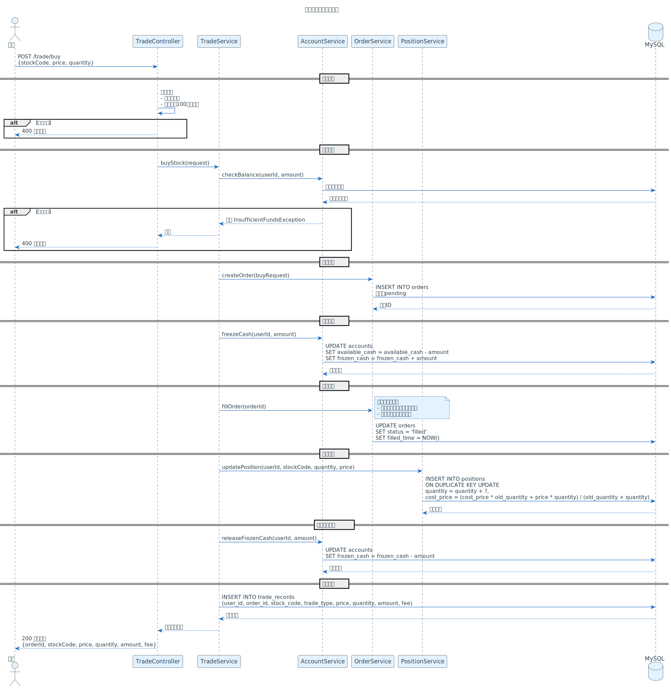
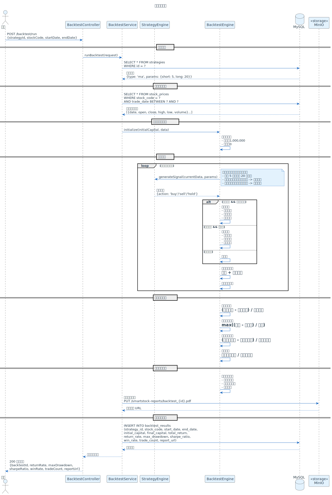
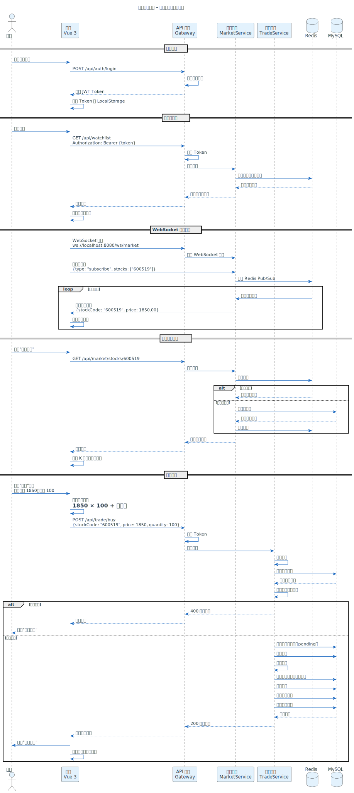

# 智能股票交易辅助系统 - 产品需求文档（PRD）

**版本**: v1.0
**最后更新**: 2026-03-09
**文档状态**: 草稿

---

## 1. 文档说明

### 1.1 文档目的

本文档详细描述智能股票交易辅助系统（smartstock-ai）的产品需求，包括功能需求、非功能需求、用户场景、交互流程等，为产品设计、开发、测试提供依据。

### 1.2 目标读者

- 产品经理
- UI/UX 设计师
- 前端开发工程师
- 后端开发工程师
- 测试工程师

### 1.3 术语表

| 术语 | 说明 |
|------|------|
| K 线 | 蜡烛图，显示股票开盘价、收盘价、最高价、最低价 |
| 分时图 | 显示股票当日价格走势的折线图 |
| 技术指标 | MACD、KDJ、RSI 等用于分析股票走势的数学指标 |
| 回测 | 使用历史数据验证交易策略的有效性 |
| 止损 | 当股价下跌到设定价格时自动卖出，限制损失 |
| 止盈 | 当股价上涨到设定价格时自动卖出，锁定利润 |

---

## 2. 产品概述

### 2.1 产品定位

智能股票交易辅助系统是一个面向个人投资者的 AI 驱动的股票分析和模拟交易平台，通过实时行情监控、AI 智能分析、模拟交易、策略回测和风险预警，帮助用户做出更明智的投资决策。

### 2.2 核心价值

- **降低投资门槛**：AI 辅助分析，让新手也能快速上手
- **提升决策质量**：多维度数据分析，减少情绪化交易
- **控制投资风险**：实时风险监控，及时预警
- **验证交易策略**：模拟交易和回测，降低实盘风险

### 2.3 用户画像

**用户 A - 投资新手**
- 年龄：25-35 岁
- 职业：互联网从业者
- 痛点：不懂技术分析，容易追涨杀跌
- 需求：简单易懂的 AI 分析，模拟交易练手

**用户 B - 量化爱好者**
- 年龄：30-45 岁
- 职业：程序员、金融从业者
- 痛点：缺少好用的策略回测工具
- 需求：自定义策略、历史数据回测、参数优化

**用户 C - 经验投资者**
- 年龄：35-55 岁
- 职业：企业管理者、自由职业者
- 痛点：持仓多，难以实时监控风险
- 需求：风险预警、智能提醒、行情解读

---

## 3. 功能需求

### 3.1 用户管理模块

#### 3.1.1 用户注册

**功能描述**：用户通过手机号或邮箱注册账号。

**输入**：
- 手机号/邮箱
- 密码（8-20 位，包含字母和数字）
- 验证码

**输出**：
- 注册成功，跳转到登录页
- 注册失败，提示错误信息

**业务规则**：
- 手机号/邮箱不能重复
- 验证码 5 分钟内有效
- 密码需加密存储

#### 3.1.2 用户登录

**功能描述**：用户通过账号密码登录系统。

**输入**：
- 手机号/邮箱
- 密码

**输出**：
- 登录成功，跳转到首页
- 登录失败，提示错误信息

**业务规则**：
- 连续 5 次登录失败，账号锁定 30 分钟
- 登录成功后生成 JWT Token，有效期 7 天

#### 3.1.3 个人信息管理

**功能描述**：用户可以查看和修改个人信息。

**功能点**：
- 查看个人信息（昵称、头像、手机号、邮箱）
- 修改昵称
- 修改头像
- 修改密码
- 绑定/解绑手机号和邮箱

---

### 3.2 实时行情监控模块

#### 3.2.1 自选股管理

**功能描述**：用户可以添加、删除、查看自选股。

**功能点**：
- 搜索股票（支持股票代码、股票名称、拼音首字母）
- 添加自选股（最多 50 只）
- 删除自选股
- 查看自选股列表（显示股票代码、名称、当前价、涨跌幅）
- 自选股排序（按涨跌幅、成交量、自定义排序）

**交互流程**：
```
用户进入自选股页面
  ↓
查看自选股列表（实时更新价格和涨跌幅）
  ↓
点击"添加自选股"按钮
  ↓
搜索股票（输入股票代码或名称）
  ↓
选择股票，点击"添加"
  ↓
自选股列表更新
```

#### 3.2.2 行情详情页

**功能描述**：查看单只股票的详细行情信息。

**功能点**：
- 基本信息（股票代码、名称、当前价、涨跌幅、成交量、成交额）
- K 线图（日 K、周 K、月 K、分钟 K）
- 分时图（当日价格走势）
- 技术指标（MACD、KDJ、RSI、BOLL）
- 盘口数据（买一到买五、卖一到卖五）
- 资金流向（主力资金、散户资金）

**交互流程**：
```
用户点击自选股列表中的某只股票
  ↓
进入行情详情页
  ↓
默认显示日 K 线图和 MACD 指标
  ↓
用户可以切换时间周期（日 K、周 K、月 K、5 分钟、15 分钟、30 分钟、60 分钟）
  ↓
用户可以切换技术指标（MACD、KDJ、RSI、BOLL）
  ↓
用户可以查看分时图、盘口数据、资金流向
```

#### 3.2.3 实时行情推送

**功能描述**：通过 WebSocket 实时推送自选股的价格变化。

**业务规则**：
- 用户登录后，自动订阅自选股的实时行情
- 价格变化时，前端实时更新（延迟 < 1 秒）
- 用户离开页面时，取消订阅

---

### 3.3 AI 智能分析模块

#### 3.3.1 技术指标分析

**功能描述**：自动计算并展示常用技术指标。

**支持的指标**：
- MACD（指数平滑异同移动平均线）
- KDJ（随机指标）
- RSI（相对强弱指标）
- BOLL（布林带）
- MA（移动平均线）

**展示方式**：
- 在 K 线图下方叠加显示
- 支持多指标同时显示
- 支持自定义指标参数

#### 3.3.2 AI 行情解读

**功能描述**：使用 Claude API 对当前行情进行自然语言解读。

**输入**：
- 股票代码
- 当前价格
- 涨跌幅
- 成交量
- 技术指标数据

**输出**：
- AI 生成的行情分析文本（200-500 字）
- 包含：当前走势判断、支撑位和压力位、短期趋势预测、操作建议

**示例输出**：
```
【AI 行情解读】
该股今日高开高走，成交量较昨日放大 30%，显示多头力量较强。
从技术指标看，MACD 金叉，KDJ 指标处于超买区，短期有回调压力。
支撑位：45.20 元，压力位：48.50 元。
建议：短线投资者可考虑逢高减仓，中线投资者可持股观望。
```

**业务规则**：
- 每只股票每天最多生成 3 次 AI 解读（避免 API 成本过高）
- AI 解读结果缓存 1 小时

#### 3.3.3 新闻情绪分析

**功能描述**：抓取财经新闻，分析市场情绪对股价的影响。

**功能点**：
- 抓取与股票相关的新闻（来源：财经网站、社交媒体）
- 使用 AI 分析新闻情绪（正面、中性、负面）
- 展示新闻列表和情绪标签
- 统计情绪分布（正面 60%、中性 30%、负面 10%）

**交互流程**：
```
用户进入行情详情页
  ↓
点击"新闻情绪"标签
  ↓
查看新闻列表（标题、来源、发布时间、情绪标签）
  ↓
点击新闻标题，跳转到新闻详情页
```

#### 3.3.4 智能问答

**功能描述**：用户可以自然语言提问，AI 给出投资建议。

**示例问题**：
- "茅台现在可以买吗？"
- "为什么今天大盘跌了？"
- "如何判断一只股票是否被低估？"

**输出**：
- AI 生成的回答（100-300 字）
- 相关股票推荐（如果适用）

**业务规则**：
- 每个用户每天最多提问 10 次
- 问题和回答记录保存，方便用户查看历史

---

### 3.4 模拟交易模块

#### 3.4.1 虚拟账户管理

**功能描述**：系统为每个用户创建虚拟账户，初始资金 100 万元。

**功能点**：
- 查看账户余额
- 查看可用资金
- 查看冻结资金（挂单占用）
- 查看总资产（现金 + 持仓市值）
- 查看累计收益率

#### 3.4.2 买入股票

**功能描述**：用户可以使用虚拟资金买入股票。

**输入**：
- 股票代码
- 买入价格（限价单）或市价单
- 买入数量（必须是 100 的整数倍）

**输出**：
- 买入成功，扣除资金，增加持仓
- 买入失败，提示错误信息（资金不足、数量不合法等）

**业务规则**：
- 买入价格不能超过当前价格的 ±10%（涨跌停限制）
- 买入数量必须是 100 的整数倍（1 手 = 100 股）
- 买入金额 = 买入价格 × 买入数量 + 手续费
- 手续费 = 买入金额 × 0.03%（最低 5 元）

**交互流程**：



**PlantUML 源码**: [trade-flow.puml](../image/trade-flow.puml)

#### 3.4.3 卖出股票

**功能描述**：用户可以卖出持仓股票。

**输入**：
- 股票代码
- 卖出价格（限价单）或市价单
- 卖出数量（不能超过持仓数量）

**输出**：
- 卖出成功，增加资金，减少持仓
- 卖出失败，提示错误信息（持仓不足、数量不合法等）

**业务规则**：
- 卖出价格不能超过当前价格的 ±10%（涨跌停限制）
- 卖出数量必须是 100 的整数倍
- 卖出金额 = 卖出价格 × 卖出数量 - 手续费 - 印花税
- 手续费 = 卖出金额 × 0.03%（最低 5 元）
- 印花税 = 卖出金额 × 0.1%

#### 3.4.4 持仓管理

**功能描述**：查看当前持仓股票的详细信息。

**功能点**：
- 持仓列表（股票代码、名称、持仓数量、成本价、当前价、盈亏、盈亏率）
- 持仓详情（买入时间、买入价格、持仓天数）
- 持仓排序（按盈亏、盈亏率、持仓市值）

#### 3.4.5 交易记录

**功能描述**：查看历史交易记录。

**功能点**：
- 交易记录列表（股票代码、名称、买入/卖出、价格、数量、时间）
- 筛选（按时间、股票、买入/卖出）
- 导出交易记录（CSV 格式）

---

### 3.5 智能策略回测模块

#### 3.5.1 策略管理

**功能描述**：用户可以创建、编辑、删除自定义交易策略。

**策略类型**：
- 均线策略（金叉买入、死叉卖出）
- 突破策略（突破压力位买入、跌破支撑位卖出）
- 网格策略（固定价格区间内高抛低吸）
- 自定义策略（用户编写 Python 代码）

**策略参数**：
- 策略名称
- 策略类型
- 参数配置（如均线周期、突破阈值等）
- 初始资金
- 回测时间范围

#### 3.5.2 历史数据回测

**功能描述**：使用历史数据验证策略的有效性。

**输入**：
- 策略 ID
- 股票代码
- 回测开始时间
- 回测结束时间

**输出**：
- 回测报告（收益率、最大回撤、夏普比率、胜率、交易次数）
- 收益曲线图
- 交易记录明细

**业务规则**：
- 回测使用真实历史数据（从数据库或第三方 API 获取）
- 回测考虑手续费和印花税
- 回测结果缓存，避免重复计算

**回测流程**：



**PlantUML 源码**: [backtest-flow.puml](../image/backtest-flow.puml)

#### 3.5.3 AI 参数优化

**功能描述**：使用 AI 自动优化策略参数，提升收益率。

**输入**：
- 策略 ID
- 优化目标（最大化收益率、最小化回撤、最大化夏普比率）

**输出**：
- 优化后的参数配置
- 优化前后的回测对比

**业务规则**：
- AI 使用遗传算法或网格搜索优化参数
- 优化过程可能需要 1-5 分钟，异步执行
- 优化结果保存，用户可以应用到策略中

---

### 3.6 风险预警模块

#### 3.6.1 持仓风险监控

**功能描述**：实时计算持仓风险指标，提示用户。

**风险指标**：
- 持仓集中度（单只股票占总资产的比例）
- 行业集中度（单个行业占总资产的比例）
- 最大回撤（从最高点到当前的跌幅）

**预警规则**：
- 单只股票占比 > 30%，提示"持仓过于集中"
- 单个行业占比 > 50%，提示"行业风险过高"
- 最大回撤 > 20%，提示"回撤过大，建议止损"

#### 3.6.2 价格波动预测

**功能描述**：基于历史数据和 AI 模型预测短期价格波动。

**输入**：
- 股票代码
- 历史价格数据（最近 30 天）

**输出**：
- 预测未来 1-3 天的价格区间
- 预测准确度（基于历史回测）

**业务规则**：
- 预测结果仅供参考，不构成投资建议
- 预测结果每天更新一次

#### 3.6.3 止损止盈提醒

**功能描述**：用户可以为持仓股票设置止损止盈价格，触发时自动提醒。

**功能点**：
- 设置止损价（低于该价格时提醒）
- 设置止盈价（高于该价格时提醒）
- 提醒方式（站内消息、邮件、短信）

**交互流程**：
```
用户进入持仓详情页
  ↓
点击"设置止损止盈"
  ↓
输入止损价和止盈价
  ↓
保存设置
  ↓
当股价触发止损或止盈时，系统发送提醒
```

---

## 4. 非功能需求

### 4.1 性能需求

| 指标 | 要求 |
|------|------|
| 行情推送延迟 | < 1 秒 |
| 页面加载时间 | < 3 秒 |
| API 响应时间 | < 500ms（95% 请求） |
| 并发用户数 | 支持 1000+ 在线用户 |
| 数据库查询 | < 100ms（单表查询） |

### 4.2 安全需求

- 用户密码使用 BCrypt 加密存储
- API 接口使用 JWT Token 鉴权
- 敏感数据（如交易记录）加密传输（HTTPS）
- 防止 SQL 注入、XSS 攻击
- 限流：单个用户每分钟最多 100 次 API 请求

### 4.3 可用性需求

- 系统可用性 > 99%
- 数据库定期备份（每天一次）
- 关键服务支持降级（如 AI 服务不可用时，返回默认提示）

### 4.4 兼容性需求

- 前端支持主流浏览器（Chrome、Firefox、Safari、Edge）
- 移动端适配（响应式设计）

---

## 5. 用户体验设计

### 5.0 用户交互流程示例

以下是用户查看行情并买入股票的完整交互流程：



**PlantUML 源码**: [user-interaction.puml](../image/user-interaction.puml)

### 5.1 页面结构

```
首页
├── 自选股列表
├── 市场概览（沪深指数、热门股票）
└── 快捷入口（模拟交易、策略回测、风险预警）

行情详情页
├── 基本信息
├── K 线图 + 技术指标
├── AI 行情解读
├── 新闻情绪
└── 买入/卖出按钮

模拟交易页
├── 账户概览
├── 持仓列表
├── 交易记录
└── 买入/卖出操作

策略回测页
├── 策略列表
├── 创建策略
├── 回测报告
└── AI 参数优化

风险预警页
├── 风险指标
├── 预警列表
└── 止损止盈设置
```

### 5.2 交互原则

- **简洁直观**：核心功能一键直达，减少操作步骤
- **实时反馈**：操作后立即给出反馈（成功/失败提示）
- **数据可视化**：使用图表展示数据，降低理解成本
- **智能提示**：在关键操作前给出风险提示

---

## 6. 数据需求

### 6.1 数据来源

- **实时行情数据**：接入第三方股票行情 API（如新浪财经、东方财富）
- **历史数据**：从第三方 API 获取，存储到 MySQL
- **新闻数据**：爬取财经网站（如新浪财经、雪球）

### 6.2 数据存储

- **MySQL**：用户数据、交易记录、持仓数据、策略配置
- **Redis**：实时行情缓存、用户会话
- **MinIO**：回测报告、历史数据文件

---

## 7. 优先级和迭代计划

### 7.1 MVP（最小可行产品）- v0.1

**目标**：验证核心功能，快速上线

**功能范围**：
- 用户注册/登录
- 自选股管理
- 行情详情页（K 线图、技术指标）
- 模拟交易（买入、卖出、持仓）

**时间**：4 周

### 7.2 v0.2 - AI 功能

**功能范围**：
- AI 行情解读
- 智能问答
- 新闻情绪分析

**时间**：3 周

### 7.3 v0.3 - 策略回测

**功能范围**：
- 策略管理
- 历史数据回测
- AI 参数优化

**时间**：4 周

### 7.4 v0.4 - 风险预警

**功能范围**：
- 持仓风险监控
- 价格波动预测
- 止损止盈提醒

**时间**：3 周

---

## 8. 附录

### 8.1 参考资料

- [新浪财经 API 文档](https://finance.sina.com.cn/)
- [东方财富 API 文档](https://www.eastmoney.com/)
- [Claude API 文档](https://docs.anthropic.com/)

### 8.2 变更记录

| 版本 | 日期 | 变更内容 | 变更人 |
|------|------|----------|--------|
| v1.0 | 2026-03-09 | 初始版本 | 开发团队 |

---

**文档维护者**：产品团队
**审核人**：待定
**批准人**：待定
