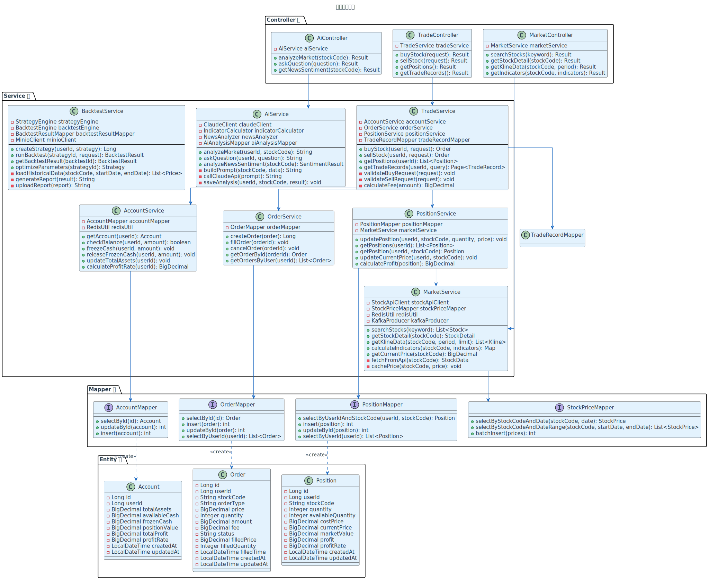
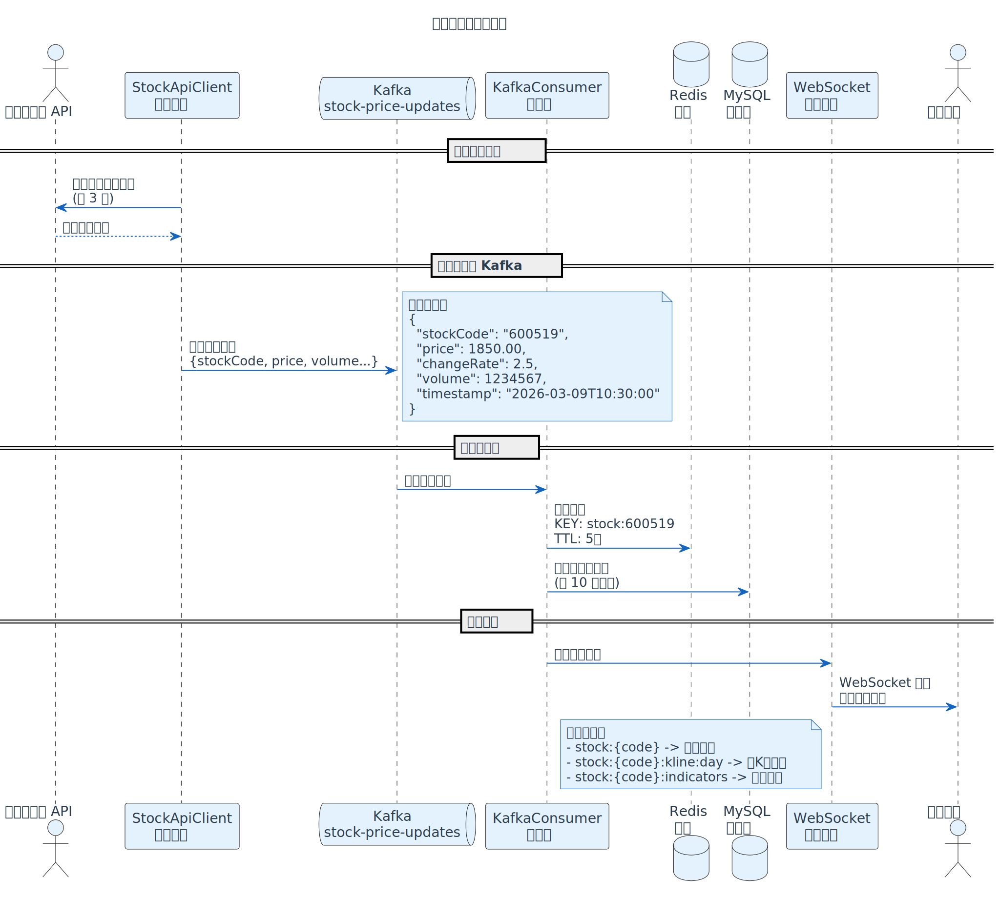

# 智能股票交易辅助系统 - 技术架构文档

**版本**: v1.0
**最后更新**: 2026-03-09
**文档状态**: 草稿

---

## 1. 文档说明

### 1.1 文档目的

本文档描述智能股票交易辅助系统的技术架构设计，包括系统架构、模块划分、技术选型、数据流、接口设计等，为开发团队提供技术实施指南。

### 1.2 目标读者

- 架构师
- 后端开发工程师
- 前端开发工程师
- 运维工程师

---

## 2. 系统架构概览

### 2.1 整体架构

系统采用前后端分离的微服务架构，主要分为以下几层：


**PlantUML 源码**: [system-architecture.puml](../image/system-architecture.puml)

### 2.2 架构特点

- **前后端分离**：前端 Vue 3，后端 Spring Boot，通过 RESTful API 通信
- **微服务化**：按业务领域拆分服务，独立部署和扩展
- **消息驱动**：使用 Kafka 处理实时行情数据流
- **缓存优先**：Redis 缓存热点数据，减少数据库压力
- **AI 集成**：LangChain4j + Claude API 提供智能分析能力

---

## 3. 技术选型

### 3.1 后端技术栈

| 技术 | 版本 | 用途 | 选型理由 |
|------|------|------|----------|
| Spring Boot | 3.5.11 | 后端框架 | 成熟稳定，生态丰富 |
| Java | 17 | 编程语言 | LTS 版本，性能优秀 |
| MyBatis Plus | 3.5.x | ORM 框架 | 简化 CRUD，支持代码生成 |
| Spring Security | 6.x | 安全框架 | 提供认证和授权 |
| JWT | 0.12.x | Token 生成 | 无状态认证 |
| Lombok | 1.18.x | 代码简化 | 减少样板代码 |
| Hutool | 5.8.x | 工具库 | 常用工具类 |
| LangChain4j | 0.x | AI 框架 | 简化 AI 应用开发 |

### 3.2 前端技术栈

| 技术 | 版本 | 用途 | 选型理由 |
|------|------|------|----------|
| Vue | 3.x | 前端框架 | 响应式，易上手 |
| Vite | 5.x | 构建工具 | 快速热更新 |
| Element Plus | 2.x | UI 组件库 | 组件丰富，文档完善 |
| ECharts | 5.x | 图表库 | 支持 K 线图，性能好 |
| Axios | 1.x | HTTP 客户端 | 简单易用 |
| Pinia | 2.x | 状态管理 | Vue 3 官方推荐 |

### 3.3 中间件

| 中间件 | 版本 | 用途 | 选型理由 |
|--------|------|------|----------|
| MySQL | 8.0 | 关系型数据库 | 成熟稳定，支持事务 |
| Redis | 7.x | 缓存 + 消息队列 | 高性能，支持多种数据结构 |
| Kafka | 3.x | 消息队列 | 高吞吐，适合实时数据流 |
| MinIO | Latest | 对象存储 | 兼容 S3，部署简单 |

---

## 4. 模块设计

### 4.0 核心服务类图



**PlantUML 源码**: [class-diagram.puml](../image/class-diagram.puml)

### 4.1 用户服务（user-service）

**职责**：
- 用户注册、登录、登出
- 用户信息管理
- JWT Token 生成和验证

**核心类**：
- `UserController`：用户接口
- `UserService`：用户业务逻辑
- `UserMapper`：用户数据访问
- `JwtUtil`：JWT 工具类

**数据表**：
- `user`：用户表
- `user_profile`：用户资料表

### 4.2 行情服务（market-service）

**职责**：
- 接入第三方行情 API
- 实时行情数据推送（WebSocket）
- 自选股管理
- 历史数据存储

**核心类**：
- `MarketController`：行情接口
- `MarketService`：行情业务逻辑
- `StockApiClient`：第三方 API 客户端
- `WebSocketHandler`：WebSocket 处理器
- `KafkaProducer`：Kafka 生产者
- `KafkaConsumer`：Kafka 消费者

**数据表**：
- `stock_info`：股票基本信息
- `stock_price`：股票价格（分区表，按日期分区）
- `user_watchlist`：用户自选股

**数据流**：



**PlantUML 源码**: [market-data-flow.puml](../image/market-data-flow.puml)

### 4.3 AI 服务（ai-service）

**职责**：
- 技术指标计算（MACD、KDJ、RSI、BOLL）
- AI 行情解读（Claude API）
- 新闻情绪分析
- 智能问答

**核心类**：
- `AiController`：AI 接口
- `AiService`：AI 业务逻辑
- `IndicatorCalculator`：技术指标计算器
- `ClaudeClient`：Claude API 客户端（基于 LangChain4j）
- `NewsAnalyzer`：新闻情绪分析器

**数据表**：
- `ai_analysis`：AI 分析记录
- `news`：新闻表
- `qa_history`：问答历史

**AI 提示词模板**：
```java
String prompt = """
你是一位专业的股票分析师。请根据以下数据分析股票走势：
股票代码：%s
当前价格：%.2f 元
涨跌幅：%.2f%%
成交量：%d 手
MACD：%.2f
KDJ：K=%.2f, D=%.2f, J=%.2f

请给出：
1. 当前走势判断
2. 支撑位和压力位
3. 短期趋势预测
4. 操作建议

回答限制在 200-500 字。
""";
```

### 4.4 交易服务（trade-service）

**职责**：
- 虚拟账户管理
- 买入、卖出订单处理
- 持仓管理
- 交易记录查询

**核心类**：
- `TradeController`：交易接口
- `TradeService`：交易业务逻辑
- `AccountService`：账户服务
- `OrderService`：订单服务
- `PositionService`：持仓服务

**数据表**：
- `account`：账户表
- `order`：订单表
- `position`：持仓表
- `trade_record`：交易记录表

**交易流程**：
```
用户发起买入请求
    ↓
校验参数（价格、数量、资金）
    ↓
创建订单（状态：待成交）
    ↓
扣除可用资金（冻结）
    ↓
模拟成交（立即成交或挂单）
    ↓
更新持仓（增加持仓数量）
    ↓
更新订单状态（已成交）
    ↓
释放冻结资金
    ↓
记录交易记录
```

### 4.5 回测服务（backtest-service）

**职责**：
- 策略管理（创建、编辑、删除）
- 历史数据回测
- 回测报告生成
- AI 参数优化

**核心类**：
- `BacktestController`：回测接口
- `BacktestService`：回测业务逻辑
- `StrategyEngine`：策略引擎
- `BacktestEngine`：回测引擎
- `OptimizerService`：参数优化服务

**数据表**：
- `strategy`：策略表
- `backtest_result`：回测结果表

**回测流程**：
```
用户创建策略
    ↓
配置策略参数（均线周期、初始资金等）
    ↓
选择回测时间范围
    ↓
加载历史数据（从 MySQL 或 MinIO）
    ↓
策略引擎执行回测
    ↓
计算收益率、最大回撤、夏普比率
    ↓
生成回测报告（保存到 MinIO）
    ↓
返回回测结果
```

### 4.6 风险服务（risk-service）

**职责**：
- 持仓风险监控
- 价格波动预测
- 止损止盈提醒

**核心类**：
- `RiskController`：风险接口
- `RiskService`：风险业务逻辑
- `RiskCalculator`：风险指标计算器
- `AlertService`：预警服务

**数据表**：
- `risk_alert`：风险预警表
- `stop_loss_profit`：止损止盈配置表

---

## 5. 数据库设计

### 5.1 数据库选型

- **MySQL 8.0**：存储用户数据、交易数据、策略数据
- **Redis 7.x**：缓存实时行情、用户会话
- **MinIO**：存储回测报告、历史数据文件

### 5.2 分库分表策略

- **stock_price 表**：按日期分区（每月一个分区）
- **trade_record 表**：按用户 ID 分表（未来扩展）

详细的数据库表结构请参考 [04-数据库设计.md](./04-数据库设计.md)。

---

## 6. 接口设计

### 6.1 RESTful API 规范

**URL 规范**：
- 使用名词复数形式：`/api/users`、`/api/stocks`
- 使用 HTTP 方法表示操作：GET（查询）、POST（创建）、PUT（更新）、DELETE（删除）
- 使用路径参数表示资源 ID：`/api/users/{id}`

**请求格式**：
```json
{
  "code": 200,
  "message": "success",
  "data": { ... }
}
```

**错误格式**：
```json
{
  "code": 400,
  "message": "参数错误",
  "data": null
}
```

### 6.2 WebSocket 协议

**连接地址**：`ws://localhost:8080/ws/market`

**消息格式**：
```json
{
  "type": "subscribe",
  "stocks": ["600519", "000001"]
}
```

**推送格式**：
```json
{
  "type": "price_update",
  "stock": "600519",
  "price": 1850.00,
  "change": 2.5
}
```

详细的接口定义请参考 [05-API接口文档.md](./05-API接口文档.md)。

---

## 7. 安全设计

### 7.1 认证和授权

- **认证方式**：JWT Token
- **Token 有效期**：7 天
- **刷新机制**：Token 过期前 1 天自动刷新

**JWT Payload**：
```json
{
  "userId": 123,
  "username": "user@example.com",
  "exp": 1678886400
}
```

### 7.2 数据加密

- **密码加密**：BCrypt（强度 10）
- **传输加密**：HTTPS（生产环境）
- **敏感数据**：AES-256 加密存储

### 7.3 防护措施

- **SQL 注入**：使用 MyBatis 参数化查询
- **XSS 攻击**：前端输入过滤，后端输出转义
- **CSRF 攻击**：使用 CSRF Token
- **限流**：Redis + Lua 脚本实现令牌桶算法
  - 单用户：100 次/分钟
  - 单 IP：500 次/分钟

---

## 8. 性能优化

### 8.1 缓存策略

**Redis 缓存**：
- **实时行情**：TTL 5 秒
- **用户信息**：TTL 30 分钟
- **技术指标**：TTL 1 小时
- **AI 分析结果**：TTL 1 小时

**缓存更新策略**：
- 实时行情：Kafka 消费者更新
- 其他数据：Cache Aside 模式（先查缓存，缓存未命中再查数据库）

### 8.2 数据库优化

- **索引优化**：为常用查询字段添加索引
- **分区表**：stock_price 表按日期分区
- **读写分离**：主库写，从库读（未来扩展）
- **连接池**：HikariCP（最大连接数 20）

### 8.3 异步处理

- **AI 分析**：异步执行，避免阻塞主线程
- **回测任务**：异步执行，使用线程池
- **消息通知**：异步发送，使用 Kafka

---

## 9. 监控和日志

### 9.1 日志规范

- **日志级别**：DEBUG、INFO、WARN、ERROR
- **日志格式**：`[时间] [级别] [类名] [方法名] - 日志内容`
- **日志存储**：本地文件 + ELK（未来扩展）

**示例**：
```
[2026-03-09 10:30:00] [INFO] [TradeService] [buyStock] - 用户 123 买入股票 600519，数量 100，价格 1850.00
```

### 9.2 监控指标

- **系统指标**：CPU、内存、磁盘、网络
- **应用指标**：QPS、响应时间、错误率
- **业务指标**：注册用户数、交易笔数、AI 调用次数

---

## 10. 技术债务和未来优化

### 10.1 当前限制

- 单体应用，未拆分微服务
- 未实现服务注册和发现
- 未实现分布式事务
- 未实现读写分离

### 10.2 未来优化方向

- **微服务化**：使用 Spring Cloud 拆分服务
- **服务治理**：引入 Nacos 或 Consul
- **分布式事务**：使用 Seata
- **消息队列**：Kafka 集群化
- **容器化**：Docker + Kubernetes 部署

---

## 11. 附录

### 11.1 技术文档

- [Spring Boot 官方文档](https://spring.io/projects/spring-boot)
- [MyBatis Plus 官方文档](https://baomidou.com/)
- [LangChain4j 官方文档](https://docs.langchain4j.dev/)
- [Redis 官方文档](https://redis.io/documentation)
- [Kafka 官方文档](https://kafka.apache.org/documentation/)

### 11.2 变更记录

| 版本 | 日期 | 变更内容 | 变更人 |
|------|------|----------|--------|
| v1.0 | 2026-03-09 | 初始版本 | 开发团队 |

---

**文档维护者**：架构团队
**审核人**：待定
**批准人**：待定
