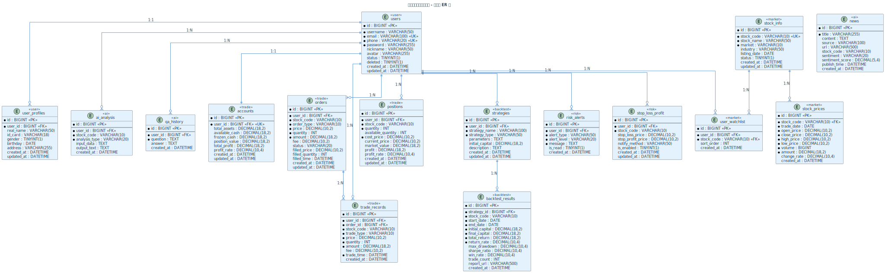

# 智能股票交易辅助系统 - 数据库设计

**版本**: v1.0
**最后更新**: 2026-03-09
**文档状态**: 草稿

---

## 1. 文档说明

### 1.1 文档目的

本文档详细描述智能股票交易辅助系统的数据库设计，包括表结构、字段定义、索引设计、分区策略等。

### 1.2 数据库环境

- **数据库类型**: MySQL 8.0
- **字符集**: utf8mb4
- **排序规则**: utf8mb4_unicode_ci
- **存储引擎**: InnoDB
- **时区**: Asia/Shanghai

---

## 2. 数据库设计原则

### 2.1 命名规范

- **表名**: 小写字母 + 下划线，复数形式（如 `users`、`stock_prices`）
- **字段名**: 小写字母 + 下划线（如 `user_id`、`created_at`）
- **索引名**: `idx_表名_字段名`（普通索引）、`uk_表名_字段名`（唯一索引）
- **外键名**: `fk_表名_字段名`

### 2.2 字段设计规范

- **主键**: 统一使用 `id` BIGINT AUTO_INCREMENT
- **时间字段**: 统一使用 `created_at`、`updated_at` DATETIME
- **逻辑删除**: 使用 `deleted` TINYINT(1) DEFAULT 0
- **金额字段**: 使用 DECIMAL(18, 2)
- **百分比字段**: 使用 DECIMAL(10, 4)

---

## 3. 用户模块

### 3.1 用户表（users）

**表说明**: 存储用户基本信息

```sql
CREATE TABLE `users` (
  `id` BIGINT NOT NULL AUTO_INCREMENT COMMENT '用户ID',
  `username` VARCHAR(50) NOT NULL COMMENT '用户名',
  `email` VARCHAR(100) NOT NULL COMMENT '邮箱',
  `phone` VARCHAR(20) DEFAULT NULL COMMENT '手机号',
  `password` VARCHAR(255) NOT NULL COMMENT '密码（BCrypt加密）',
  `nickname` VARCHAR(50) DEFAULT NULL COMMENT '昵称',
  `avatar` VARCHAR(255) DEFAULT NULL COMMENT '头像URL',
  `status` TINYINT(1) DEFAULT 1 COMMENT '状态：0-禁用，1-正常',
  `deleted` TINYINT(1) DEFAULT 0 COMMENT '逻辑删除：0-未删除，1-已删除',
  `created_at` DATETIME DEFAULT CURRENT_TIMESTAMP COMMENT '创建时间',
  `updated_at` DATETIME DEFAULT CURRENT_TIMESTAMP ON UPDATE CURRENT_TIMESTAMP COMMENT '更新时间',
  PRIMARY KEY (`id`),
  UNIQUE KEY `uk_users_email` (`email`),
  UNIQUE KEY `uk_users_phone` (`phone`),
  KEY `idx_users_username` (`username`)
) ENGINE=InnoDB DEFAULT CHARSET=utf8mb4 COMMENT='用户表';
```

### 3.2 用户资料表（user_profiles）

**表说明**: 存储用户扩展信息

```sql
CREATE TABLE `user_profiles` (
  `id` BIGINT NOT NULL AUTO_INCREMENT COMMENT '资料ID',
  `user_id` BIGINT NOT NULL COMMENT '用户ID',
  `real_name` VARCHAR(50) DEFAULT NULL COMMENT '真实姓名',
  `id_card` VARCHAR(18) DEFAULT NULL COMMENT '身份证号',
  `gender` TINYINT(1) DEFAULT NULL COMMENT '性别：0-女，1-男',
  `birthday` DATE DEFAULT NULL COMMENT '生日',
  `address` VARCHAR(255) DEFAULT NULL COMMENT '地址',
  `created_at` DATETIME DEFAULT CURRENT_TIMESTAMP COMMENT '创建时间',
  `updated_at` DATETIME DEFAULT CURRENT_TIMESTAMP ON UPDATE CURRENT_TIMESTAMP COMMENT '更新时间',
  PRIMARY KEY (`id`),
  UNIQUE KEY `uk_user_profiles_user_id` (`user_id`),
  CONSTRAINT `fk_user_profiles_user_id` FOREIGN KEY (`user_id`) REFERENCES `users` (`id`) ON DELETE CASCADE
) ENGINE=InnoDB DEFAULT CHARSET=utf8mb4 COMMENT='用户资料表';
```

---

## 4. 行情模块

### 4.1 股票信息表（stock_info）

**表说明**: 存储股票基本信息

```sql
CREATE TABLE `stock_info` (
  `id` BIGINT NOT NULL AUTO_INCREMENT COMMENT '股票ID',
  `stock_code` VARCHAR(10) NOT NULL COMMENT '股票代码（如600519）',
  `stock_name` VARCHAR(50) NOT NULL COMMENT '股票名称（如贵州茅台）',
  `market` VARCHAR(10) NOT NULL COMMENT '市场：SH-上海，SZ-深圳',
  `industry` VARCHAR(50) DEFAULT NULL COMMENT '所属行业',
  `listing_date` DATE DEFAULT NULL COMMENT '上市日期',
  `status` TINYINT(1) DEFAULT 1 COMMENT '状态：0-停牌，1-正常',
  `created_at` DATETIME DEFAULT CURRENT_TIMESTAMP COMMENT '创建时间',
  `updated_at` DATETIME DEFAULT CURRENT_TIMESTAMP ON UPDATE CURRENT_TIMESTAMP COMMENT '更新时间',
  PRIMARY KEY (`id`),
  UNIQUE KEY `uk_stock_info_code` (`stock_code`),
  KEY `idx_stock_info_name` (`stock_name`),
  KEY `idx_stock_info_industry` (`industry`)
) ENGINE=InnoDB DEFAULT CHARSET=utf8mb4 COMMENT='股票信息表';
```

### 4.2 股票价格表（stock_prices）

**表说明**: 存储股票历史价格（按日期分区）

```sql
CREATE TABLE `stock_prices` (
  `id` BIGINT NOT NULL AUTO_INCREMENT COMMENT '价格ID',
  `stock_code` VARCHAR(10) NOT NULL COMMENT '股票代码',
  `trade_date` DATE NOT NULL COMMENT '交易日期',
  `open_price` DECIMAL(10, 2) NOT NULL COMMENT '开盘价',
  `close_price` DECIMAL(10, 2) NOT NULL COMMENT '收盘价',
  `high_price` DECIMAL(10, 2) NOT NULL COMMENT '最高价',
  `low_price` DECIMAL(10, 2) NOT NULL COMMENT '最低价',
  `volume` BIGINT NOT NULL COMMENT '成交量（手）',
  `amount` DECIMAL(18, 2) NOT NULL COMMENT '成交额（元）',
  `change_rate` DECIMAL(10, 4) DEFAULT NULL COMMENT '涨跌幅（%）',
  `created_at` DATETIME DEFAULT CURRENT_TIMESTAMP COMMENT '创建时间',
  PRIMARY KEY (`id`, `trade_date`),
  UNIQUE KEY `uk_stock_prices_code_date` (`stock_code`, `trade_date`),
  KEY `idx_stock_prices_date` (`trade_date`)
) ENGINE=InnoDB DEFAULT CHARSET=utf8mb4 COMMENT='股票价格表'
PARTITION BY RANGE (TO_DAYS(`trade_date`)) (
  PARTITION p202601 VALUES LESS THAN (TO_DAYS('2026-02-01')),
  PARTITION p202602 VALUES LESS THAN (TO_DAYS('2026-03-01')),
  PARTITION p202603 VALUES LESS THAN (TO_DAYS('2026-04-01')),
  PARTITION p202604 VALUES LESS THAN (TO_DAYS('2026-05-01')),
  PARTITION p202605 VALUES LESS THAN (TO_DAYS('2026-06-01')),
  PARTITION p202606 VALUES LESS THAN (TO_DAYS('2026-07-01')),
  PARTITION p_future VALUES LESS THAN MAXVALUE
);
```

### 4.3 用户自选股表（user_watchlist）

**表说明**: 存储用户自选股

```sql
CREATE TABLE `user_watchlist` (
  `id` BIGINT NOT NULL AUTO_INCREMENT COMMENT '自选股ID',
  `user_id` BIGINT NOT NULL COMMENT '用户ID',
  `stock_code` VARCHAR(10) NOT NULL COMMENT '股票代码',
  `sort_order` INT DEFAULT 0 COMMENT '排序顺序',
  `created_at` DATETIME DEFAULT CURRENT_TIMESTAMP COMMENT '创建时间',
  PRIMARY KEY (`id`),
  UNIQUE KEY `uk_watchlist_user_stock` (`user_id`, `stock_code`),
  KEY `idx_watchlist_user_id` (`user_id`),
  CONSTRAINT `fk_watchlist_user_id` FOREIGN KEY (`user_id`) REFERENCES `users` (`id`) ON DELETE CASCADE
) ENGINE=InnoDB DEFAULT CHARSET=utf8mb4 COMMENT='用户自选股表';
```

---

## 5. AI 分析模块

### 5.1 AI 分析记录表（ai_analysis）

**表说明**: 存储 AI 分析结果

```sql
CREATE TABLE `ai_analysis` (
  `id` BIGINT NOT NULL AUTO_INCREMENT COMMENT '分析ID',
  `user_id` BIGINT NOT NULL COMMENT '用户ID',
  `stock_code` VARCHAR(10) NOT NULL COMMENT '股票代码',
  `analysis_type` VARCHAR(20) NOT NULL COMMENT '分析类型：market-行情解读，qa-智能问答',
  `input_data` TEXT COMMENT '输入数据（JSON格式）',
  `output_text` TEXT COMMENT 'AI输出文本',
  `created_at` DATETIME DEFAULT CURRENT_TIMESTAMP COMMENT '创建时间',
  PRIMARY KEY (`id`),
  KEY `idx_ai_analysis_user_id` (`user_id`),
  KEY `idx_ai_analysis_stock_code` (`stock_code`),
  KEY `idx_ai_analysis_created_at` (`created_at`)
) ENGINE=InnoDB DEFAULT CHARSET=utf8mb4 COMMENT='AI分析记录表';
```

### 5.2 新闻表（news）

**表说明**: 存储财经新闻

```sql
CREATE TABLE `news` (
  `id` BIGINT NOT NULL AUTO_INCREMENT COMMENT '新闻ID',
  `title` VARCHAR(255) NOT NULL COMMENT '新闻标题',
  `content` TEXT COMMENT '新闻内容',
  `source` VARCHAR(100) DEFAULT NULL COMMENT '新闻来源',
  `url` VARCHAR(500) DEFAULT NULL COMMENT '新闻链接',
  `stock_code` VARCHAR(10) DEFAULT NULL COMMENT '关联股票代码',
  `sentiment` VARCHAR(20) DEFAULT NULL COMMENT '情绪：positive-正面，neutral-中性，negative-负面',
  `sentiment_score` DECIMAL(5, 4) DEFAULT NULL COMMENT '情绪分数（-1到1）',
  `publish_time` DATETIME DEFAULT NULL COMMENT '发布时间',
  `created_at` DATETIME DEFAULT CURRENT_TIMESTAMP COMMENT '创建时间',
  PRIMARY KEY (`id`),
  KEY `idx_news_stock_code` (`stock_code`),
  KEY `idx_news_publish_time` (`publish_time`)
) ENGINE=InnoDB DEFAULT CHARSET=utf8mb4 COMMENT='新闻表';
```

### 5.3 问答历史表（qa_history）

**表说明**: 存储用户问答历史

```sql
CREATE TABLE `qa_history` (
  `id` BIGINT NOT NULL AUTO_INCREMENT COMMENT '问答ID',
  `user_id` BIGINT NOT NULL COMMENT '用户ID',
  `question` TEXT NOT NULL COMMENT '用户问题',
  `answer` TEXT COMMENT 'AI回答',
  `created_at` DATETIME DEFAULT CURRENT_TIMESTAMP COMMENT '创建时间',
  PRIMARY KEY (`id`),
  KEY `idx_qa_history_user_id` (`user_id`),
  KEY `idx_qa_history_created_at` (`created_at`)
) ENGINE=InnoDB DEFAULT CHARSET=utf8mb4 COMMENT='问答历史表';
```

---

## 6. 交易模块

### 6.1 账户表（accounts）

**表说明**: 存储用户虚拟账户

```sql
CREATE TABLE `accounts` (
  `id` BIGINT NOT NULL AUTO_INCREMENT COMMENT '账户ID',
  `user_id` BIGINT NOT NULL COMMENT '用户ID',
  `total_assets` DECIMAL(18, 2) DEFAULT 1000000.00 COMMENT '总资产',
  `available_cash` DECIMAL(18, 2) DEFAULT 1000000.00 COMMENT '可用资金',
  `frozen_cash` DECIMAL(18, 2) DEFAULT 0.00 COMMENT '冻结资金',
  `position_value` DECIMAL(18, 2) DEFAULT 0.00 COMMENT '持仓市值',
  `total_profit` DECIMAL(18, 2) DEFAULT 0.00 COMMENT '累计收益',
  `profit_rate` DECIMAL(10, 4) DEFAULT 0.0000 COMMENT '收益率（%）',
  `created_at` DATETIME DEFAULT CURRENT_TIMESTAMP COMMENT '创建时间',
  `updated_at` DATETIME DEFAULT CURRENT_TIMESTAMP ON UPDATE CURRENT_TIMESTAMP COMMENT '更新时间',
  PRIMARY KEY (`id`),
  UNIQUE KEY `uk_accounts_user_id` (`user_id`),
  CONSTRAINT `fk_accounts_user_id` FOREIGN KEY (`user_id`) REFERENCES `users` (`id`) ON DELETE CASCADE
) ENGINE=InnoDB DEFAULT CHARSET=utf8mb4 COMMENT='账户表';
```

### 6.2 订单表（orders）

**表说明**: 存储买卖订单

```sql
CREATE TABLE `orders` (
  `id` BIGINT NOT NULL AUTO_INCREMENT COMMENT '订单ID',
  `user_id` BIGINT NOT NULL COMMENT '用户ID',
  `stock_code` VARCHAR(10) NOT NULL COMMENT '股票代码',
  `order_type` VARCHAR(10) NOT NULL COMMENT '订单类型：buy-买入，sell-卖出',
  `price` DECIMAL(10, 2) NOT NULL COMMENT '委托价格',
  `quantity` INT NOT NULL COMMENT '委托数量（股）',
  `amount` DECIMAL(18, 2) NOT NULL COMMENT '委托金额',
  `fee` DECIMAL(10, 2) DEFAULT 0.00 COMMENT '手续费',
  `status` VARCHAR(20) DEFAULT 'pending' COMMENT '订单状态：pending-待成交，filled-已成交，cancelled-已撤销',
  `filled_price` DECIMAL(10, 2) DEFAULT NULL COMMENT '成交价格',
  `filled_quantity` INT DEFAULT 0 COMMENT '成交数量',
  `filled_time` DATETIME DEFAULT NULL COMMENT '成交时间',
  `created_at` DATETIME DEFAULT CURRENT_TIMESTAMP COMMENT '创建时间',
  `updated_at` DATETIME DEFAULT CURRENT_TIMESTAMP ON UPDATE CURRENT_TIMESTAMP COMMENT '更新时间',
  PRIMARY KEY (`id`),
  KEY `idx_orders_user_id` (`user_id`),
  KEY `idx_orders_stock_code` (`stock_code`),
  KEY `idx_orders_status` (`status`),
  KEY `idx_orders_created_at` (`created_at`)
) ENGINE=InnoDB DEFAULT CHARSET=utf8mb4 COMMENT='订单表';
```

### 6.3 持仓表（positions）

**表说明**: 存储用户持仓

```sql
CREATE TABLE `positions` (
  `id` BIGINT NOT NULL AUTO_INCREMENT COMMENT '持仓ID',
  `user_id` BIGINT NOT NULL COMMENT '用户ID',
  `stock_code` VARCHAR(10) NOT NULL COMMENT '股票代码',
  `quantity` INT NOT NULL COMMENT '持仓数量（股）',
  `available_quantity` INT NOT NULL COMMENT '可用数量（股）',
  `cost_price` DECIMAL(10, 2) NOT NULL COMMENT '成本价',
  `current_price` DECIMAL(10, 2) DEFAULT NULL COMMENT '当前价',
  `market_value` DECIMAL(18, 2) DEFAULT NULL COMMENT '市值',
  `profit` DECIMAL(18, 2) DEFAULT NULL COMMENT '盈亏',
  `profit_rate` DECIMAL(10, 4) DEFAULT NULL COMMENT '盈亏率（%）',
  `created_at` DATETIME DEFAULT CURRENT_TIMESTAMP COMMENT '创建时间',
  `updated_at` DATETIME DEFAULT CURRENT_TIMESTAMP ON UPDATE CURRENT_TIMESTAMP COMMENT '更新时间',
  PRIMARY KEY (`id`),
  UNIQUE KEY `uk_positions_user_stock` (`user_id`, `stock_code`),
  KEY `idx_positions_user_id` (`user_id`)
) ENGINE=InnoDB DEFAULT CHARSET=utf8mb4 COMMENT='持仓表';
```

### 6.4 交易记录表（trade_records）

**表说明**: 存储交易记录

```sql
CREATE TABLE `trade_records` (
  `id` BIGINT NOT NULL AUTO_INCREMENT COMMENT '记录ID',
  `user_id` BIGINT NOT NULL COMMENT '用户ID',
  `order_id` BIGINT NOT NULL COMMENT '订单ID',
  `stock_code` VARCHAR(10) NOT NULL COMMENT '股票代码',
  `trade_type` VARCHAR(10) NOT NULL COMMENT '交易类型：buy-买入，sell-卖出',
  `price` DECIMAL(10, 2) NOT NULL COMMENT '成交价格',
  `quantity` INT NOT NULL COMMENT '成交数量（股）',
  `amount` DECIMAL(18, 2) NOT NULL COMMENT '成交金额',
  `fee` DECIMAL(10, 2) DEFAULT 0.00 COMMENT '手续费',
  `trade_time` DATETIME NOT NULL COMMENT '成交时间',
  `created_at` DATETIME DEFAULT CURRENT_TIMESTAMP COMMENT '创建时间',
  PRIMARY KEY (`id`),
  KEY `idx_trade_records_user_id` (`user_id`),
  KEY `idx_trade_records_order_id` (`order_id`),
  KEY `idx_trade_records_stock_code` (`stock_code`),
  KEY `idx_trade_records_trade_time` (`trade_time`)
) ENGINE=InnoDB DEFAULT CHARSET=utf8mb4 COMMENT='交易记录表';
```

---

## 7. 回测模块

### 7.1 策略表（strategies）

**表说明**: 存储用户自定义策略

```sql
CREATE TABLE `strategies` (
  `id` BIGINT NOT NULL AUTO_INCREMENT COMMENT '策略ID',
  `user_id` BIGINT NOT NULL COMMENT '用户ID',
  `strategy_name` VARCHAR(100) NOT NULL COMMENT '策略名称',
  `strategy_type` VARCHAR(50) NOT NULL COMMENT '策略类型：ma-均线，breakout-突破，grid-网格，custom-自定义',
  `parameters` TEXT COMMENT '策略参数（JSON格式）',
  `initial_capital` DECIMAL(18, 2) DEFAULT 1000000.00 COMMENT '初始资金',
  `description` TEXT COMMENT '策略描述',
  `created_at` DATETIME DEFAULT CURRENT_TIMESTAMP COMMENT '创建时间',
  `updated_at` DATETIME DEFAULT CURRENT_TIMESTAMP ON UPDATE CURRENT_TIMESTAMP COMMENT '更新时间',
  PRIMARY KEY (`id`),
  KEY `idx_strategies_user_id` (`user_id`)
) ENGINE=InnoDB DEFAULT CHARSET=utf8mb4 COMMENT='策略表';
```

### 7.2 回测结果表（backtest_results）

**表说明**: 存储回测结果

```sql
CREATE TABLE `backtest_results` (
  `id` BIGINT NOT NULL AUTO_INCREMENT COMMENT '回测ID',
  `strategy_id` BIGINT NOT NULL COMMENT '策略ID',
  `stock_code` VARCHAR(10) NOT NULL COMMENT '股票代码',
  `start_date` DATE NOT NULL COMMENT '回测开始日期',
  `end_date` DATE NOT NULL COMMENT '回测结束日期',
  `initial_capital` DECIMAL(18, 2) NOT NULL COMMENT '初始资金',
  `final_capital` DECIMAL(18, 2) NOT NULL COMMENT '最终资金',
  `total_return` DECIMAL(18, 2) NOT NULL COMMENT '总收益',
  `return_rate` DECIMAL(10, 4) NOT NULL COMMENT '收益率（%）',
  `max_drawdown` DECIMAL(10, 4) DEFAULT NULL COMMENT '最大回撤（%）',
  `sharpe_ratio` DECIMAL(10, 4) DEFAULT NULL COMMENT '夏普比率',
  `win_rate` DECIMAL(10, 4) DEFAULT NULL COMMENT '胜率（%）',
  `trade_count` INT DEFAULT 0 COMMENT '交易次数',
  `report_url` VARCHAR(500) DEFAULT NULL COMMENT '回测报告URL（MinIO）',
  `created_at` DATETIME DEFAULT CURRENT_TIMESTAMP COMMENT '创建时间',
  PRIMARY KEY (`id`),
  KEY `idx_backtest_results_strategy_id` (`strategy_id`),
  KEY `idx_backtest_results_stock_code` (`stock_code`)
) ENGINE=InnoDB DEFAULT CHARSET=utf8mb4 COMMENT='回测结果表';
```

---

## 8. 风险模块

### 8.1 风险预警表（risk_alerts）

**表说明**: 存储风险预警记录

```sql
CREATE TABLE `risk_alerts` (
  `id` BIGINT NOT NULL AUTO_INCREMENT COMMENT '预警ID',
  `user_id` BIGINT NOT NULL COMMENT '用户ID',
  `alert_type` VARCHAR(50) NOT NULL COMMENT '预警类型：concentration-持仓集中，drawdown-回撤过大，volatility-波动过大',
  `alert_level` VARCHAR(20) NOT NULL COMMENT '预警级别：low-低，medium-中，high-高',
  `message` TEXT NOT NULL COMMENT '预警消息',
  `is_read` TINYINT(1) DEFAULT 0 COMMENT '是否已读：0-未读，1-已读',
  `created_at` DATETIME DEFAULT CURRENT_TIMESTAMP COMMENT '创建时间',
  PRIMARY KEY (`id`),
  KEY `idx_risk_alerts_user_id` (`user_id`),
  KEY `idx_risk_alerts_is_read` (`is_read`),
  KEY `idx_risk_alerts_created_at` (`created_at`)
) ENGINE=InnoDB DEFAULT CHARSET=utf8mb4 COMMENT='风险预警表';
```

### 8.2 止损止盈配置表（stop_loss_profit）

**表说明**: 存储用户止损止盈配置

```sql
CREATE TABLE `stop_loss_profit` (
  `id` BIGINT NOT NULL AUTO_INCREMENT COMMENT '配置ID',
  `user_id` BIGINT NOT NULL COMMENT '用户ID',
  `stock_code` VARCHAR(10) NOT NULL COMMENT '股票代码',
  `stop_loss_price` DECIMAL(10, 2) DEFAULT NULL COMMENT '止损价',
  `stop_profit_price` DECIMAL(10, 2) DEFAULT NULL COMMENT '止盈价',
  `notify_method` VARCHAR(50) DEFAULT 'message' COMMENT '通知方式：message-站内消息，email-邮件，sms-短信',
  `is_enabled` TINYINT(1) DEFAULT 1 COMMENT '是否启用：0-禁用，1-启用',
  `created_at` DATETIME DEFAULT CURRENT_TIMESTAMP COMMENT '创建时间',
  `updated_at` DATETIME DEFAULT CURRENT_TIMESTAMP ON UPDATE CURRENT_TIMESTAMP COMMENT '更新时间',
  PRIMARY KEY (`id`),
  UNIQUE KEY `uk_stop_loss_profit_user_stock` (`user_id`, `stock_code`),
  KEY `idx_stop_loss_profit_user_id` (`user_id`)
) ENGINE=InnoDB DEFAULT CHARSET=utf8mb4 COMMENT='止损止盈配置表';
```

---

## 9. 索引优化建议

### 9.1 高频查询索引

- `stock_prices` 表：`(stock_code, trade_date)` 联合索引
- `orders` 表：`(user_id, status, created_at)` 联合索引
- `positions` 表：`(user_id, stock_code)` 联合索引

### 9.2 覆盖索引

对于只查询特定字段的查询，可以创建覆盖索引：

```sql
-- 查询用户自选股列表（只需要 stock_code）
CREATE INDEX idx_watchlist_user_stock ON user_watchlist(user_id, stock_code);
```

---

## 10. 分区策略

### 10.1 按时间分区

- `stock_prices` 表：按月分区，每月一个分区
- `trade_records` 表：按月分区（未来扩展）

### 10.2 分区维护

定期添加新分区：

```sql
-- 添加新月份分区
ALTER TABLE stock_prices ADD PARTITION (
  PARTITION p202607 VALUES LESS THAN (TO_DAYS('2026-08-01'))
);
```

---

## 11. 数据初始化脚本

### 11.1 创建数据库

```sql
CREATE DATABASE IF NOT EXISTS smartstock_ai
DEFAULT CHARACTER SET utf8mb4
COLLATE utf8mb4_unicode_ci;

USE smartstock_ai;
```

### 11.2 初始化测试数据

```sql
-- 插入测试用户
INSERT INTO users (username, email, password, nickname) VALUES
('test@example.com', 'test@example.com', '$2a$10$...', '测试用户');

-- 插入股票信息
INSERT INTO stock_info (stock_code, stock_name, market, industry) VALUES
('600519', '贵州茅台', 'SH', '白酒'),
('000001', '平安银行', 'SZ', '银行');
```

---

## 12. 附录

### 12.1 ER 图



**PlantUML 源码**: [database-er.puml](../image/database-er.puml)

### 12.2 变更记录

| 版本 | 日期 | 变更内容 | 变更人 |
|------|------|----------|--------|
| v1.0 | 2026-03-09 | 初始版本 | 开发团队 |

---

**文档维护者**：数据库团队
**审核人**：待定
**批准人**：待定
